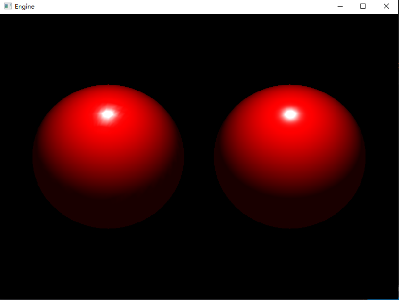

# Gouraud With Phong
很久之前学d3d11时候写的一个demo，还原了LearnOpenGL上Gouraud和Phong光照模型的效果对比

   

 
 

## 参考资料及其他资料
https://learnopengl-cn.github.io/02%20Lighting/02%20Basic%20Lighting/

http://www.rastertek.com/tutdx11.html